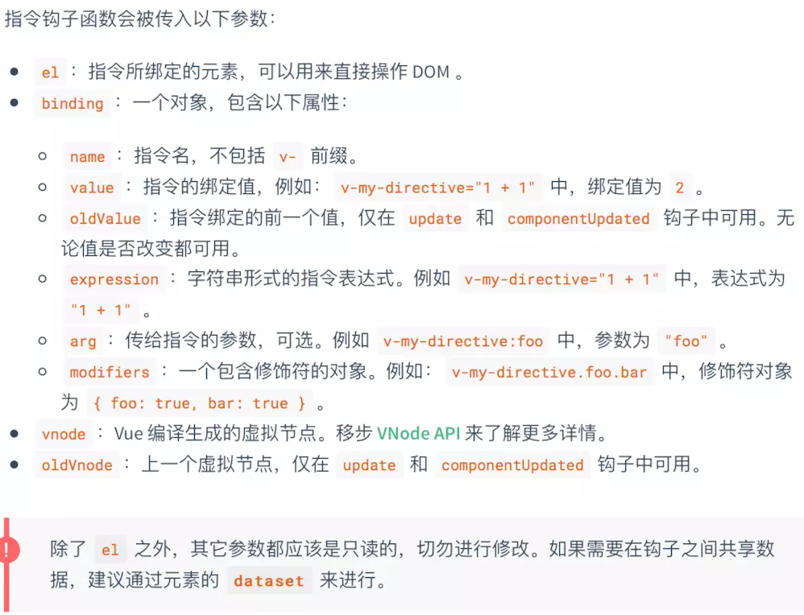

# 自定义指令

#### 前言

Vue自带的指令很多，v-for | v-if | v-show...
但是这些指令都是比较偏向于工具化，有些时候在实现具体的业务逻辑的时候，发现不够用，如何来自定义指令。

#### 使用规则

**一个指令定义对象可以提供如下几个钩子函数 (均为可选)：**

- bind：只调用一次，指令第一次绑定到元素时调用，在这里可以进行一次性的初始化设置。
- inserted：被绑定元素插入父节点时调用（仅保证父节点存在，但不一定已被插入文档中）。
- update：所在组件的 VNode 更新时调用，但是可能发生在其子 VNode 更新之前。指令的值可能发生了改变，也可能没有。但是你可以通过比较更新前后的值来忽略不必要的模板更新 (详细的钩子函数参数见下)。
- componentUpdated：指令所在组件的 VNode 及其子 VNode 全部更新后调用。
- unbind：只调用一次，指令与元素解绑时调用。

**钩子函数详细参数：**

便于理解的小案例，戳一戳
:point_right:
[**此处**](/assets/example/back.js)，了解下

> [!WARNING]
> 指令的命名采用小驼峰式，如: aaaBbb -> 调用v-aaa-bbb
