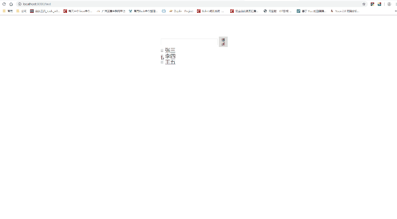

# 列表渲染

#### 前言

模板列表渲染，主要是以类js写法去实现数据绑定及render tree 渲染。

#### 基本使用

##### v-for

- 预期：*Array | Object | String | Number*

- 用法：根据表达式的值。来渲染DOM，详细如下：

- **在v-for里面使用Array**

``` vue
HTML:

    <div v-for="(item, index) in [1, 2, 3]" :key="index">
        {{ item }} - {{ index }}
    </div>

RESULT:

    <div>1 - 0</div>
    <div>2 - 1</div>
    <div>3 - 2</div>
```

- **在v-for里面使用Object**

``` vue
HTML:

    <div v-for="(value, name, index) in {name: '张三', age: 20}" :key="index">
        {{ name }}: {{ value }}
    </div>

RESULT:

    <div>name: 张三</div>
    <div>age: 20</div>
```

- **在v-for里面使用String**

``` vue
HTML:

    <div v-for="(value, index) in 'abc'" :key="index">
        {{ value }} - {{ index }}
    </div>

RESULT:

    <div>a - 0</div>
    <div>b - 1</div>
    <div>c - 2</div>
```

- **在v-for里面使用Number**

``` vue
HTML:

    <div v-for="(value, index) in 3" :key="index">
        {{ value }} - {{ index }}
    </div>

RESULT:

    <div>1 - 0</div>
    <div>2 - 1</div>
    <div>3 - 2</div>
```

#### 扩展（选学）

在学习以下内容前，需了解以下知识：

- Virtual DOM（VDOM）      // 虚拟DOM，与ast 同理

> [!TIP]
> 本节点不做详细赘述，有兴趣可戳一戳
> :point_right:
> [**此处**](https://www.jianshu.com/p/af0b398602bc)

##### 为什么要使用key？

说到这个问题，我先举个栗子（**未使用key**）：

``` vue
HTML:

    <div class="input-group">
        <input class="inp" type="text" v-model="currentValue">
        <button class="btn" @click="add">添加</button>
    </div>
    <div v-for="item in list">
        <input type="checkbox" /> {{ item }}
    </div>

JS（es6）：

    data () {
        return {
            currentValue: '',
            list: ['张三', '李四', '王五']
        };
    },
    methods: {
        add () {
            this.list.unshift(this.currentValue);
        }
    }

RESULT:
    查看下面GIF
```

----

结果：



----

##### 总结

通过以上列子可以了解到，key作用简单来说就是Model更新时，触发viewModel（VDOM diff）更新view层，起到唯一键值作用。
