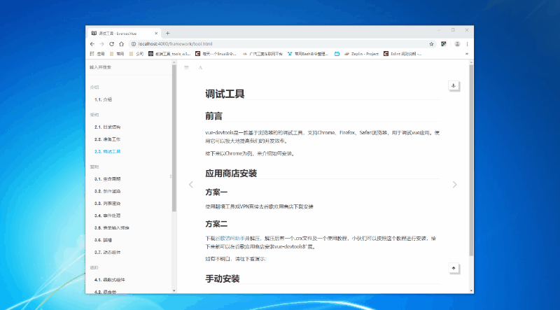

# 调试工具

#### 前言

vue-devtools是一款基于浏览器的的调试工具，支持Chrome、Firefox、Safari浏览器，用于调试vue应用。使用它可以极大地提高我们的开发效率。

接下来以Chrome为例，介绍如何安装。

#### 应用商店安装

#### 方案一

使用翻墙工具或VPN直接去谷歌应用商店下载安装

#### 方案二

下载[谷歌访问助手](http://www.ggfwzs.com/)并解压，解压后有一个.crx文件及一个使用教程，小伙们可以按照这个教程进行安装，接下来就可以在谷歌应用商店安装vue-devtools扩展。

如有疑问，请往下看演示:



#### 手动安装

手动安装分三步, 如下:

第一步：狠狠的点击[**此处**](https://github.com/vuejs/vue-devtools.git)下载

第二步：找到下载文件并解压, 执行以下命令:

``` javascript
cd [目录文件]        // 切换到项目文件

npm install         // 可以去喝一杯, 放松放松~

npm run build       // 构建项目
```

第三步：添加至chrome游览器

打开chrome浏览器, 按【设置> 更多工具> 扩展程序】步骤进入扩展程序页面, 打开开发者模式, 点击“加载已解压的扩展程序”按钮, 选择【vue-devtools> shells】下的chrome文件夹, 点击确定。

如有疑问，请往下看演示:


