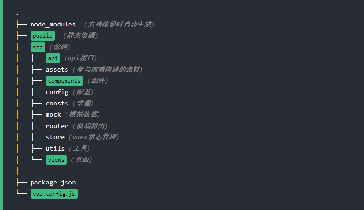

# 目录结构

#### 正文

针对现有框架EversVue及本文档做了一个简单的目录分析，如有说错的地方，欢迎指正，共同进步，谢谢~

#### EversVue 目录结构

#### 基础

基础主要从了解VUE渲染的虚拟DOM整个生命周期和带有 v- 前缀的特殊属性的指令 (Directives)以及常用组件等方面进行学习。基础目录学习完，就能基本应对业务的基本界面交互开发啦~

#### 进阶

学会的基础的Vue应用，进一步我们就要考虑代码的延展性，为了符合代码的复用原则和开闭原则，在进阶目录中主要学习函数式组件、混合类、自定义指令以及自己造轮子的插件，后台的伙伴这块应该很快能够吸收,毕竟这块的思想就是从后台迁移过来的~

#### 附录

学会了基础（码砖）和进阶（造轮子）阶段，基于目前前后端分离的状态，最后学习下前端工程化就很有必要了。主要体现在模块化、组件化、规范化开发以及自动化打包部署，最重要的一点是:代码的工程化很高程度上能优化前端性能的。所以前端的开发部署打包都离不开一个好的工程化工具,例如最近常用就是webpack、gulp等。

> 大致讲述本文档的骨干模块以及作用，后续有需要可以进行其他方面的补充。那我们开始吧~
:stuck_out_tongue:
